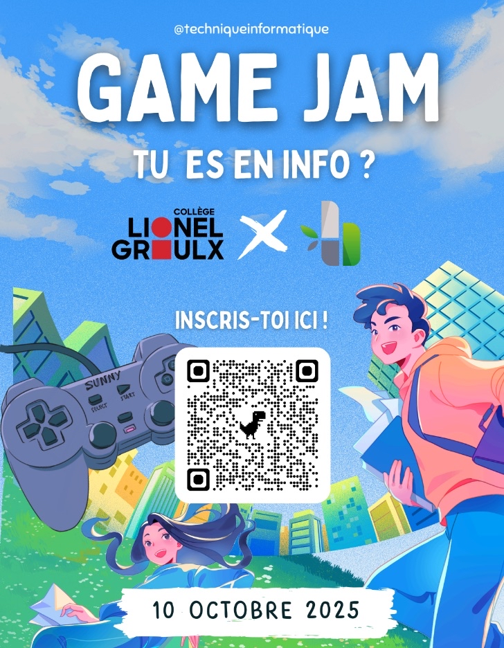
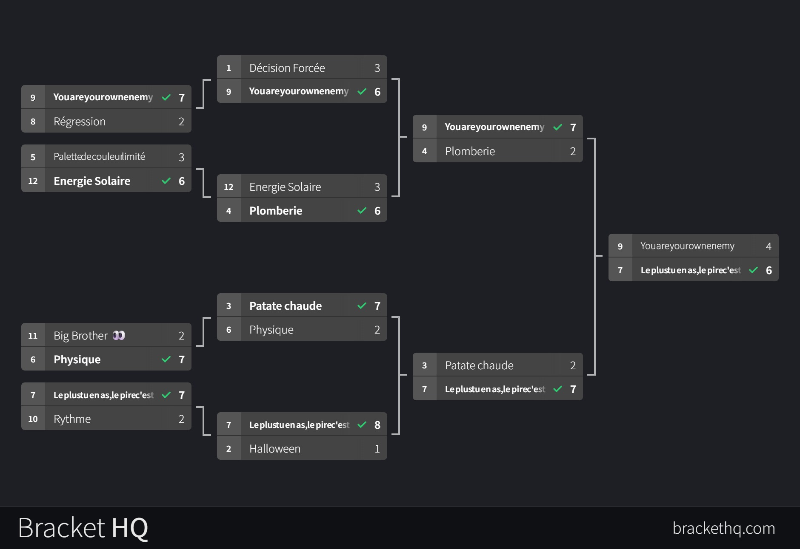

# Game Jam Lionel-Groulx x BambooSoft — Octobre 2025
## **Thème: Le plus tu en as, le pire c'est**

## 1. Introduction
Bienvenue à notre **Game Jam d'une journée Lionel-Groulx !**
Chaque équipe de **2 à 4 personnes** aura **10 heures** pour créer un prototype jouable autour d'un thème révélé au lancement.

Objectifs :
- Stimuler la créativité.
- Apprendre de nouvelles choses.
- S'amuser et partager une belle expérience en équipe.

---

## 2. Calendrier de l'événement

### **Jeudi 9 octobre — Rencontre Teams**

**15h**
- Présentation du Jam et de son fonctionnement
- Finalisation des équipes
- Vote et révélation du **thème officiel**

**16h**
- Séparation en équipes pour débuter le **brainstorm**
- Planification des premières idées de jeu
- Discussion et partage entre les membres de chaque équipe
- **Synchronisation technique** : choisir la version Unity à utiliser, créer le repository GitHub et s'inviter les uns les autres, puis créer le projet de base pour faire un choix entre 2D ou 3D

Des **salles Teams** seront créées à l'avance pour faciliter les échanges et le brainstorm à distance.

---

### **Vendredi 10 octobre — Jam au Collège Lionel-Groulx (local H314)**

**Horaire : 9h à 19h**

- **Arrivez un peu à l'avance pour vous installer (entre 8h30 et 9h).**
- **Apportez votre lunch** pour le dîner (**il y aura quelques collations sur place fournies**).
- **Souper pizza** offert par **BambooSoft** vers 19h.
- Pendant le repas, chaque équipe fera la **démo de son projet**.
- On termine la journée avec un **vote collectif** pour élire les gagnants selon les critères ci-dessous.

---

## 3. Système de vote et critères du jury

Chaque équipe sera notée sur **trois catégories**, chacune sur **5 étoiles** :

1. **Respect du thème**
2. **Niveau de fun**
3. **L'humour**

**Résultat final :**
 **Thème + Fun + Humour = Note finale (sur 15 étoiles)**

L'équipe ayant **le score total le plus élevé** remporte le Game Jam 🏆

---

## 4. Équipes préliminaires

### **Équipe Glorpus**
- Colin Dupré
- Manuel-David Murillo-Aldan

### **Équipe ROMA Projects**
- Alex Conti
- Matis Grenier
- Olivier Briand-Champagne
- Romain Ouellet
- Victor Thibodeau

### **Équipe Touski**
- Nathaniel Ruël-Grossinger
- Nicolas Charette-Naud

[Jouer à Touski Thief ici](https://mrbamboo.itch.io/touski-thrief)

### ** Équipe Monsieur Bonin**
- Alexis Bonin

---

## 5. Esprit du Jam (Obligatoire)
La participation vient avec des engagements clairs :

1. **Venir pour avoir du fun et apprendre** – Le but premier n'est pas de gagner, mais de profiter de l'expérience.
2. **Favoriser l'inspiration et le partage** – S'inspirer entre équipes, montrer son travail, apprendre des autres.
3. **Respect et inclusivité** – Aucun contenu offensant ou comportement hostile. Tout le monde doit se sentir bienvenu.

---

## 6. Avant le Game Jam

### 6.1 Préparatifs
#### Préparatifs techniques
- **Moteur de jeu** : installer la même version sur tous les postes (Unity, Godot, Unreal, etc.).
- **Projet** : créer un projet vide avec les settings de base (résolution, inputs, pipeline 2D/3D, organisation des dossiers).
- **GitHub** : créer un dépôt public, inviter les collaborateurs, et tester un commit/push avant le jam.
- **Validation** : s'assurer que tout le monde peut cloner et lancer le projet sans problème.

#### Préparatifs à la soumission
- Créer ou vérifier que chaque équipe a un **compte itch.io**.
- Pour les projets Unity : s'assurer que le **build WebGL** est activé dans les modules Unity Hub.
- Compiler et déployer un petit **"Hello World"** test sur itch.io la veille pour valider que la soumission fonctionne.

#### Brainstorm efficace
- **Pas de mauvaises idées** : accueillez toutes les suggestions sans jugement initial, l'évaluation vient après.
- **Quantité avant qualité** : générez un maximum d'idées rapidement (10-15 min), puis filtrez ensuite.
- **Construisez sur les idées des autres** : utilisez les suggestions comme tremplin ("oui, et..." plutôt que "oui, mais...").
- **Restez visuels** : dessinez, schématisez, créez des mockups rapides pour concrétiser les concepts.
- **Gardez le thème en tête** : revenez régulièrement au thème pour valider que vos idées s'y rattachent.
- **Définissez les rôles** : qui fera quoi (code, art, son, game design) pour optimiser le temps

#### Trucs et astuces pour bien gérer le jam

Après le brainstorm, vous allez avoir le goût de faire **plein de choses** !!!
**DANGER** : c'est un Game Jam de **10 heures** seulement — ça va aller **vraiment vite**.

Prenez votre scope, **coupez-le en deux… puis encore en deux… et encore une fois.**
C'est à peu près tout ce que vous allez réussir à faire, et c'est parfait comme ça.
Le but est de **finir quelque chose de jouable**, pas de viser un jeu complet AAA.

Quelques bonnes pratiques pour garder vos projets clairs et efficaces :

- **Utilisez le système de messagerie Unity (Event-based)**
  (ex. : `Unity Messaging System` ou `Event System` pour centraliser les communications entre objets)
- **Découpez votre jeu en plusieurs scènes**, puis assemblez-les ensemble.
- **Faites des scripts très simples**, qui font **une seule chose** bien.
- **Utilisez beaucoup de prefabs** pour bien séparer les éléments et favoriser la réutilisation.
- **Committez souvent dans Git** pour éviter les pertes et faciliter la collaboration.

### 6.2 Sélection du thème
- Chaque participant peut **suggérer un thème** à l'avance.
- Les organisateurs recueillent les propositions et préparent une liste finale.
- Au début du jam, un vote avec un outil style "bracket tournament" permettera de mettre en compétition les thèmes pour arriver au **thème officiel** du gamejam.

---

## 7. Pendant le Game Jam

### 7.1 Organisation générale
- **Durée** : 10 heures (9h à 19h).
- **Équipes** : de 2 à 4 personnes.
- **Thème choisi** : Le plus tu en as, le pire c'est

  

### 7.2 Création

#### Assets et ressources
- Utilisation de l'IA pour générer des assets est permise (images, musique, sons, etc.).
- Réutilisation autorisée d'**assets externes** (sons, musiques, images, sprites, modèles 3D, polices).
- Ces assets doivent être **libres de droits, créés avant le jam, ou achetés légalement**.
- Obligation de **créditer les sources** dans la soumission.

#### Code
- Utilisation de l'IA pour générer du code est permise (ex. : GitHub Copilot, ChatGPT).
- Réutilisation de **code provenant de projets antérieurs** permise (moteurs, librairies, snippets).
- Interdiction d'utiliser du code propriétaire ou non autorisé par licence.

---

## 8. Outils pour le brainstorm

- [Figma](https://www.figma.com/)
- [Miro](https://miro.com/)
- [LucidSpark](https://lucid.co/lucidspark)

---

## 9. Bouffe

- **Dîner** : apportez votre lunch (**il y aura quelques collations sur place fournies**).
- **Souper** : pizza offerte par **BambooSoft** chez
  [Pizzeria Melis](https://maps.app.goo.gl/eEAmgJ7W2sPA3U7P9)

> **Recommandation** :
> - Dormir des heures régulières (de 7 à 9h pour dormir la veille ... faites pas une nuit blanche).
> - Manger, boire et se dégourdir durant le jam, en allant voir les autres équipes.
> - Éviter les "hype/crash" d'énergie liés aux jujubes, chocolats et boissons sucrées.  

---

## 10. Conclusion

**Amusez-vous, testez vos idées et surtout, finissez quelque chose !**
C'est ça, l'esprit du Game Jam

---
